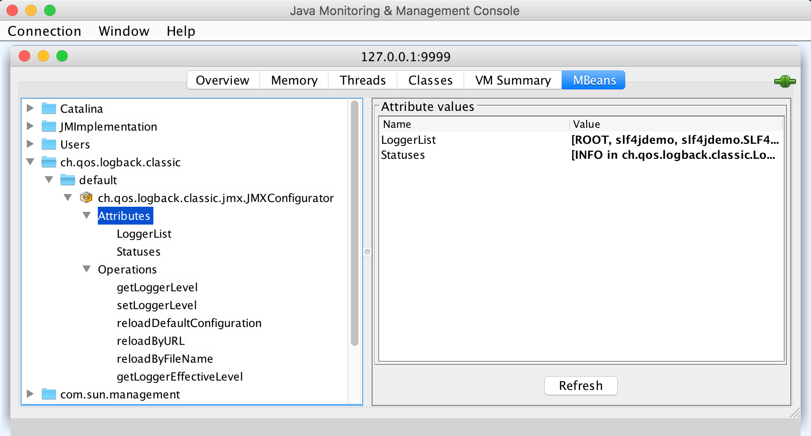

# Purpose

The purpose of this project is to illustrate how [slf4j](http://www.slf4j.org) can be configured as a central logging framework in a web application. 

As an implementation, [logback](http://logback.qos.ch/) is used, but this could easily be replaced by another implementation.

The application also shows how logging made through other frameworks (in this case java.util.logging) can be bridged to use slf4j instead.

# Building

This project uses [Maven](https://maven.apache.org/). The following command will build the project and generate a slf4jdemo.war file in the /target folder:

```
mvn clean compile
```

# Deploying

The .war file can be deployed on any Java web container. Using Docker, and using Tomcat as an example, this can be a one-liner:

```
docker run --name slf4jdemo-tomcat -p 8080:8080 -d tomcat:9-alpine
```

(assuming you can access the Tomcat container through "localhost" from your host machine).

The .war file can be copied into this container as follows:

```
docker cp ./target/slf4jdemo.war slf4jdemo-tomcat:/usr/local/tomcat/webapps
```

Watch the standard output of the Tomcat container using the following command (since logging is configured to go to stdout, you'll see logging statements appear when you execute it):

```
docker logs -f slf4jdemo-tomcat
```

Finally, to trigger the servlet to generate some logging statements, send a request to http://localhost:8080/slf4jdemo/ (depending on your docker version, you may have to replace localhost by your docker host).

If you want to get into the container using a shell session, use the following command:

```
docker exec -it slf4j-tomcat sh
```

# Experiments

## Playing around with the log level
Try to adapt the logback configuration file (e.g. set the root log level to "error") and redeploy. You'll see that both the log statements made through slf4j as well as those through JUL are impacted.

## Changing the log level at runtime

### By changing the configuration file

blabla

### Through JMX

Replace the aforementioned `docker run` command with this one to enable JMX support:

```
docker run --name slf4jdemo-tomcat -p 8080:8080 -p 9999:9999 -e CATALINA_OPTS="-Dcom.sun.management.jmxremote -Dcom.sun.management.jmxremote.port=9999 -Dcom.sun.management.jmxremote.rmi.port=9999 -Dcom.sun.management.jmxremote.authenticate=false -Dcom.sun.management.jmxremote.ssl=false -Djava.rmi.server.hostname=localhost" -d tomcat:9-alpine
```

(assuming you can access your Tomcat container from your host machine as "localhost")

You can connect to the JMX server using jconsole:

```
jconsole
```

Choose "localhost:9999" (again, replace localhost if needed)

You'll be able to tune the logback configuration dynamically:



